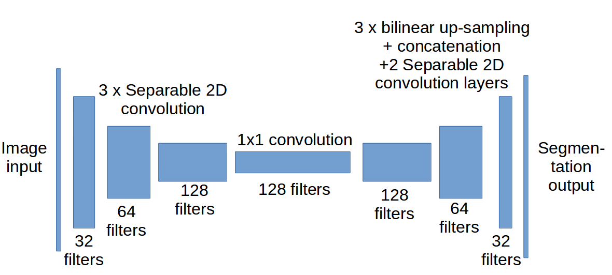

 # Project: RoboND Follow-Me Project

## 1. Introduction

The assignment of this project was to train the neural network that will enable the quadcopter in the Udacity's simulator to track a target. This has been achieved with the help of Fully Convolutional Networks as explained in this write-up.

## 2. Fully Convolutional Network Architecture.

### 2.1. Overview

Neural network used in this project contains two main sections, encoder and decoder.

In the encoder section input image is scaled down with the help of the separable 2D convolution in three layers. This has been achieved by using the kernel of size 3x3 and the stride of 2 with the "same" padding. After each separable 2D convolution RELU activation has been performed as well as batch normalization. First layer starts with 32 filters and each consecutive layer doubles the number of filters to compensate for the tensor width and height dimensions scaling down by the stride of 2. At the end of the encoder section 1x1 convolution with RELU activation and batch normalization has been performed.

The results of previously described layers are used as inputs in the three blocks of the decoder section. Each layer of the decoder block starts with the bilinear upsampling of the smaller input tensor. The result is concatenated with the tensor of the same width and height from the encoder section. After concatenation two more separable 2D convolution layers are added. Each previous decoder block serves as a input to the next decoder block and gets concatenated with the appropriate tensor from the encoder section (skip connections). Each consecutive decoder block uses smaller number of filters as width and height of tensors increases.

### 2.2. Benefits, drawbacks and alternatives.

Benefit of the Fully Convolutional Networks is that each pixel gets classified and that  can result in high precision of the object's location. That can be a drawback as well. For example the shirt of the hero in our simulator can be switched for some other similar shirt from some other person. It is hard to train the model to not to focus on lower level attributes (hair, pants, shirt etc.) but to focus on the whole person . For that reason I believe that the hero detection would perform better with use of some more "traditional" object detection classifier like YOLO or SSD that can be very fast and performant on mobile devices.

## 3. Parameters chosen for the neural network training

I have decided for the batch size of 64 as this was the size at which my GPU was training the neural network without "out of memory" errors. Based on the batch size of 64 I have chosen 400 steps per epoch to go through all available training sample images + augmented samples per one epoch.

I have decided for the learning rate of 0.001 as this was the learning rate that was appropriately minimizing loss without overfitting the training set. For the same reasons I have decided for the 20 epochs as well. I have determined those values based on experimentation.

## 4. 1x1 Convolutions vs. Fully Connected Layers

The advantage of 1x1 convolutions comparing to Fully Connected Layers normally used for image classification is that they preserve dimensionality. The preservation of the dimensionality was required for the image segmentation in this assignment, and that is why I have decided for the 1x1 convolution as the "middle" layer.

## 5. Skip connections

The reason for using the skip connections (contacination of individual encoder and decoder layers in the decoder section) is to reuse some of the image input data that has been lost during the encoding and the decoding process. That way we can get the best of the both worlds, abstract features from the deep layers of the convolutional neural networks and features from the layers that are closer to the image input. 

## 6. Limitations to the neural network

This neural network is very limited to only one person with the specific outfit combination. To be able to use the network for the tracking of some other persons, animals etc. it would be necessary to retrain the neural network. If we would like to track for example multiple persons or animals at the same time we would need to increase the number of classes(num_classes parameter). For each new person or animal we would need to add additional class and prepare image samples based on which that class can be trained, in the same way that we have done for the hero.

## 7. Future Enhancements

For future enhancements the neural network could be trained with larger sample size, the number of filters per layer could be additionally optimized and additional layers could be added to the network. By converting input images to HSV color channel before the neural network processing changes in the scene brightness could be addressed.

It would be interesting to see how object detection neural network models like SSD or YOLO perform in comparison to the FCNN. I believe that they could perform better in most of the cases because they would perform detection based an all visible attributes of an object and not only pixel-wise segmentation.

## 8. Conclusion

This was interesting project where we have used convolutional neural networks for the first time. Separable 2D convolution has shown very performance friendly although the use case was too limited to make the final conclusion if they are robust enough for use in real world scenario.
